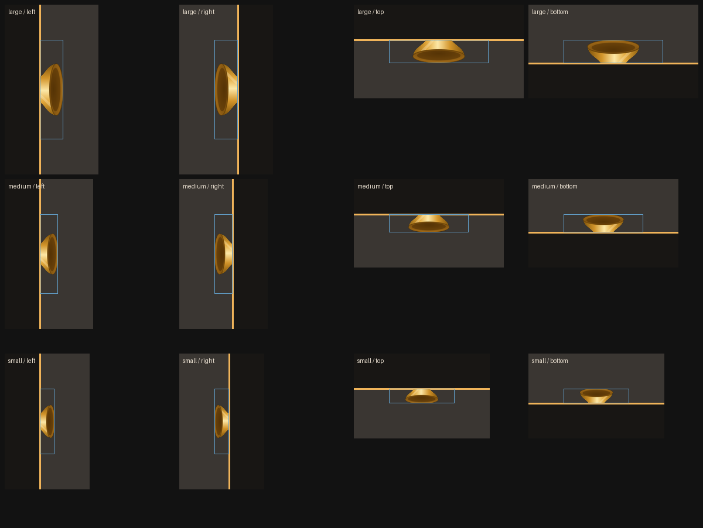

# suona 唢呐

A macOS desktop pet that watches the coding agents running on your machine and
tells you what they have been doing.

It takes the shape of a *suona* — the Chinese double-reed horn. It floats on
your desktop, aims its bell at the middle of the screen, puffs out little
musical notes when it has news, and tucks itself into the side of the screen
when you want it out of the way.


**[中文文档 →](README.zh-CN.md)**

---

## What it watches

| Agent | Where the data lives | What is extracted |
|---|---|---|
| **Hermes** | `~/.hermes/cron/jobs.json`<br>`~/.hermes/cron/executions.db` | Per-run outcome of every scheduled job: completed, failed, delivery failed; duration; the actual error text (timeouts, API failures). Plus job count, failure count and paused count. |
| **Codex** | `~/.codex/sessions/**/rollout-*.jsonl`<br>`~/.codex/session_index.jsonl` | Thread name, working directory, turn count, CLI version, whether a session is still running. |
| **Claude Code** | `~/.claude/projects/<project>/<session>.jsonl` | AI-generated session title, prompt count, output tokens, model, subagent count. |

All of it is **read-only**. suona never writes to another tool's directory.

## Install

Requires Node 20+, pnpm, and a Rust toolchain.

```bash
pnpm install
pnpm tauri dev          # development
pnpm tauri build        # produce a .app
```

To install it somewhere stable (`launch at login` records the path the app is
running from, so a build directory is a bad place to enable it from):

```bash
./scripts/install.sh    # copies to /Applications
```

## Using it

| Action | Result |
|---|---|
| Drag the pet | Moves it; the bell always faces the centre of the screen |
| Drag it to a clear screen edge | Snaps to the edge and hides, leaving only the bell showing |
| Click it while docked | Pokes out a little further and opens the list beside it |
| Click it while floating | Opens the list |
| Click a list row | Have the pet read that item aloud, with its chime |
| Click elsewhere / `Esc` / ✕ | Closes the list |
| **Right-click** | Native menu → **Settings** / **Quit** |
| S / M / L | Three sizes for the pet (default L) |
| Sound toggle | Report chimes, off by default |

<p align="center">
  
</p>

## Settings

Right-click → **Settings**:

```
┌─────────────────────────────────────┐
│ Settings                         ×  │
├─────────────────────────────────────┤
│ Tick the agents to watch. Unticking  │
│ one only stops suona reporting it —  │
│ none of its data files are touched.  │
├─────────────────────────────────────┤
│ ☑ Hermes              Detected       │
│   [~/.hermes                      ]  │
│   found cron/jobs.json               │
│ ☐ Codex               Disabled       │
│   [~/.codex                       ]  │
│   disabled, no longer reported       │
├─────────────────────────────────────┤
│ [Back to list] [Re-detect] No change │
└─────────────────────────────────────┘
```

### Disabling is not deleting

suona is strictly read-only. "Delete a certain agent's messages" is implemented
as **disabling** it: it stops being collected and reported, nothing on disk is
touched, and ticking it again brings it straight back.

That is a deliberate boundary. Actually deleting records out of `~/.hermes` or
`~/.codex` would corrupt another tool's working data, and suona is an observer —
it has no business editing someone else's files.

### Detection

Each agent has a set of *marker* files; finding any one means it is installed:

| Agent | Markers |
|---|---|
| Hermes | `cron/jobs.json`, `cron/executions.db`, `config.yaml` |
| Codex | `sessions`, `session_index.jsonl` |
| Claude Code | `projects` |

Several markers per agent on purpose: a freshly installed tool may not have
written any session files yet, and calling that "not installed" would be wrong.

Three states are distinguished: **detected**, **directory mismatch** (the
directory exists but holds no data for this tool — usually a typo), and
**not found**.

### Paths

Defaults are `~/.hermes`, `~/.codex`, `~/.claude`. Any absolute path works, and
`~` is expanded on input and shortened back for display. An empty path means
"use the default", which keeps the settings file portable between machines.

Changes commit on blur or Enter, not on every keystroke — a path is only
meaningful once it is complete, and each commit re-scans every agent. A relative
path is rejected and highlighted rather than silently accepted.

**Re-detect** exists because the settings page can sit open while you install
something new. It reports *what changed* ("Codex: detected") rather than just
flashing "done" — otherwise you cannot tell "nothing changed" from "the button
did nothing", which is exactly what you want to know after installing something.

## How it works

```
src-tauri/src/
  model.rs          The unified event vocabulary every collector speaks
  agents.rs         Per-agent configuration: paths, enablement, detection
  app.rs            Polling loop, de-duplication, window geometry, IPC
  pet.rs            Pet geometry: sizes, bell aiming, edge docking
  screens.rs        Asks NSScreen which screen edges are actually free
  crash.rs          Abnormal-exit detection and reporting
  collectors/
    hermes.rs       jobs.json × executions.db, joined
    codex.rs        Rollout transcript parsing
    claude.rs       Project transcript parsing
src/
  main.ts           Speech queue, settings view, click/drag discrimination
  style.css         Transparent window, suona animation, docked layout
index.html          Pet markup and the inline suona SVG
```

Each collector knows exactly one tool's on-disk layout and normalises it into a
single `AgentEvent`:

```rust
pub struct AgentEvent {
    id: String,            // stable dedup key: one run is announced once
    agent: Agent,          // Hermes | Codex | ClaudeCode
    kind: EventKind,       // JobCompleted | JobFailed | SessionCompleted | ...
    severity: Severity,    // Info | Success | Warning | Error
    title: String,         // the bubble headline
    detail: String,
    project: Option<String>,
    at: i64,
    meta: BTreeMap<String, String>,
}
```

### News, not state

The event stream carries *things that happened* — a job ran, a session ended, a
run failed. Current state ("2 jobs are paused", "next run at 10:00") lives in
the per-agent rollup and only appears on hover or in the list. Mixing the two
made the pet repeat the same status line every twenty seconds.

### No backlog replay

Announcements are windowed to the last hour and de-duplicated by event id, so
launching suona does not replay yesterday's failures. On startup the pet greets
you once with the current rollup instead.

## Engineering notes

The interesting bugs, kept because the reasoning is reusable.

### Reading someone else's SQLite database

SQLite takes locks and touches journal files even for a read-only open, so
opening Hermes' live cron database directly can fail. Worse, such an open often
*appears* to succeed and only errors on first use — which meant the fallback
path never triggered and Hermes reported nothing at all.

Every candidate handle is now probed with a real query before it is trusted, and
a snapshot copy (including any `-wal`/`-shm` siblings) is the fallback.

### Mixed-DPI multi-monitor

On a desk with a 2× built-in display and a 1× external one, the same physical
coordinate means different things in each display's point space. A `set_position`
aimed at a perfectly good spot landed the window somewhere with no screen at all:

```
restore: rejecting (5412,2764) — pet would land at (5792,3264), outside every display.
watchdog: pet at (2946,1348) is on no display — recentring
```

Note the second line: the recentring that the one-shot check triggered *also*
landed wrong. Only continuous verification caught it.

Three layers, the point being to stop trusting a single check:

1. A remembered position is validated against where **the pet** would be, not
   the window — a window can overlap a screen while the pet, which hangs at its
   bottom-centre, lands in the gap between displays.
2. The window is not docked while it lies across two displays.
3. A watchdog re-checks every second and pulls the pet back to the primary
   display if it is on no screen at all.

### Which screen edges are usable

Assuming "the sides are free" is wrong: the Dock can be moved to either side,
which is then exactly where the pet would hide — behind the Dock, invisible and
unclickable. `NSScreen.visibleFrame` is the screen minus the menu bar and the
Dock, and the difference from `frame` measures each edge:

```
screens: insets top=34 bottom=0 left=0 right=47 -> dockable top=true bottom=true left=true right=false
com.apple.dock orientation = right
```

The rule is only "avoid the Dock's side". The menu bar's edge is not refused,
just kept clear of by its measured height — refusing it as well once left the
pet with no reachable edge at all.

### Hanging off an edge is not straddling two displays

The guard above once demanded that the window fit *entirely* inside a display.
Pushing the pet against the left edge of the screen sends its x negative:

```
evaluate: rect=(-426,68,760x1484) straddles displays — not docking
```

That is simply what dragging to an edge looks like. Reading it as a straddle
made the left and bottom edges impossible to dock to. Only a window that
overlaps two displays is refused now.

### Dragging used to be barely possible

The window's `Moved` event fires hundreds of times per drag. Doing display
enumeration and an IPC push on each one, on the main thread, left the window
unable to follow the cursor. All position-derived work now samples at ~30 Hz on
a background thread.

### Telling a click from a drag

A drag finishes with a `click` event, so dragging the pet used to open the list.
Pointer coordinates cannot separate the two — the window follows the cursor, so
the pointer barely moves *relative to the window*. The window's own travel can,
and the geometry thread already measures it. The front end asks
`take_was_drag()`, which is consuming so a stale verdict cannot swallow the next
real click.

### Notifications must not be optimistic

The launch-at-login toggle reads back the real LoginAgent state rather than
showing what was requested. If enabling fails, the switch springs back.

## Testing

Geometry is not eyeballed. `scripts/simulate_dock.py` re-implements the CSS
layout maths, rasterises the real suona SVG, and renders what each screen edge
and aiming angle would actually look like:

```bash
python3 scripts/simulate_dock.py     # writes assets/preview/
cd src-tauri && cargo test --lib     # 24 tests
```

That simulator is what caught the snap threshold being unreachable: the pet sits
mid-window, so a pet-centred test would have required dragging the window 144px
off-screen before docking could ever fire.

There are also environment-gated hooks for behaviour that is invisible from
outside the process. All are inert unless their variable is set.

```bash
# Opening the list must not be mistaken for a drag, and must not close itself
SUONA_SELFTEST=1 ./target/debug/suona
# SUONA_SELFTEST: 3s later expanded=true dock=None (want expanded=true dock=None)

# A docked pet stays docked while the list is open beside it
SUONA_DOCKTEST=1 ./target/debug/suona
# SUONA_DOCKTEST: list open -> Left (want Some(Left))

# A once-refused edge position now docks
SUONA_EDGETEST=1 ./target/debug/suona
# SUONA_EDGETEST: -> Left (want Some(Left)) PASS

# A background panic is reported live, and does not kill the app
SUONA_PANIC_AFTER_MS=3000 SUONA_QUIT_AFTER_MS=8000 ./target/debug/suona
# crash.log has thread/location/backtrace; session.json ends clean:true
```

`SUONA_CONFIG_DIR` relocates the whole profile, so these never touch real
settings.

### Abnormal-exit reporting

| Failure | Consequence | How you find out |
|---|---|---|
| Panic on the main thread | Process dies | Logged to `crash.log`, reported next launch |
| **Panic on a background thread** | **Process lives, feature is quietly dead** | A watchdog notices within 3s and says so |
| Killed / power loss | No chance to clean up | Reported next launch |

The middle row is the dangerous one: a dead poller thread looks exactly like a
healthy, quiet one. `crash.log` is the forensic trail; `session.json` is a
one-bit "did the last run shut down properly" flag, so an unclean end is
provable at the next launch. Clean exits are marked in `RunEvent::Exit` and are
never reported.

## Known trade-offs

- **Claude Code has no "finished" record.** The transcript simply stops growing,
  so "running" is approximated by "the file was written to in the last 5
  minutes".
- **Token counts come from the tail 1 MB of a transcript.** Cumulative figures
  for very long sessions read low, in exchange for not parsing multi-megabyte
  files.
- **Polling every 20 seconds.** Enough for this, and far simpler and more
  portable than watching files.
- **The list does not group by agent.** Everything is one timeline with a
  colour-coded chip per row, which uses the vertical space better.
- **Clicking outside to dismiss works by window focus.** A window only ever sees
  clicks inside its own bounds, so opening the list takes focus — which means
  suona becomes the frontmost app and whatever you were in loses focus.

## License

Apache License 2.0 — see [LICENSE](LICENSE).
